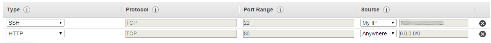

Deploying an abcEconomics simulation on-line
====================================

Prepare your simulation to be displayed on the web
--------------------------------------------------

In order for your simulation to be able to be run on the web it must be running
in the web browser. for this you need to add :func:`@gui(...) <abcEconomics.gui.gui>` before the main function.
Further :func:`@gui <abcEconomics.gui.gui>` needs to
be switched to :code:`serve`::

    ...

    title = "Computational Complete Economy Model on Climate Gas Reduction"
    text = """ This simulation simulates climate change
    """

    parameters = OrderedDict({'wage_stickiness': (0, 0.5, 1.0),
                                         'price_stickiness': (0, 0.5, 1.0),
                                         'network_weight_stickiness': (0, 0.5, 1.0),
                                         'carbon_tax': (0, 50.0, 80.0),
                                         'tax_change_time': 100,
                                         'rounds': 200})

    @gui(parameters, text=text, title=title, serve=True)
    def main(simulation_parameters):
        ...

        simulation = Simulation(processes=1)
        simulation.run()

        #simulation.graphs() This must be commented out or deleted
        simulation.finalize()

    if __name__ == '__main__':
        main(parameters)

It is important to note that the :code:`main()` function is not called, when start.py
is imported! :code:`if __name__ == '__main__':`, means that it is not called
when start.py is imported. you can also simply delete the call of :code:`main()`.

:func:`@gui <abcEconomics.gui.gui>` is the part that generates the web application and runs it.
:code:`serve` must be set to True in
:func:`@gui(simulation_parameters, text=text, title=title, serve=True) <abcEconomics.gui.gui>`

The easiest way to get your code to the server is via github. For this follow the
following instructions.
Push the simulation to github. If you are unsure what git and github is, refer to
this `gitimmersion.com<http://gitimmersion.com/>`_. If your code is not yet a git
repository change in your directory::

    git init
    git add --all
    git commit -m"initial commit"

Go to github sign up and create a new repository. It will than display you instruction
how to push an existing repository from the command line your, they will look like this::

   git remote add origin https://github.com/your_name/myproject.git
   git push -u origin master

Deploy you abcEconomics simulation on amazon ec2 or your own Ubuntu server
------------------------------------------------------------------

create an amazon ec2 instance following `Amazon's tutorial here<http://docs.aws.amazon.com/AWSEC2/latest/UserGuide/ec2-launch-instance_linux.html>`_

make sure that in step 7b, configure the security groups, such that you have a HTTP access. This setting allows access to port 80 (HTTP) from anywhere, and ssh access only from your IP address.

then from the console ssh into your account

::

    ssh -i amazoninstanceweb2py.pem ubuntu@ec2-54-174-70-207.compute-1.amazonaws.com

Install the server software and abcEconomics requirements::

    sudo pip3 install abcEconomics

copy or clone your abcEconomics simulation into the ~/myproject directory the easiest way is to use a git repository, but you can also use scp::

    git clone https://github.com/your_name/myproject.git

start simulation with nohup::

    cd myproject

    nohup sudo python3 start.py &
    tail -f nohup.out

The last line displays the logging messages.

If something does not work delete all files and directories that have root as user. (find them with :code:`ll`)

