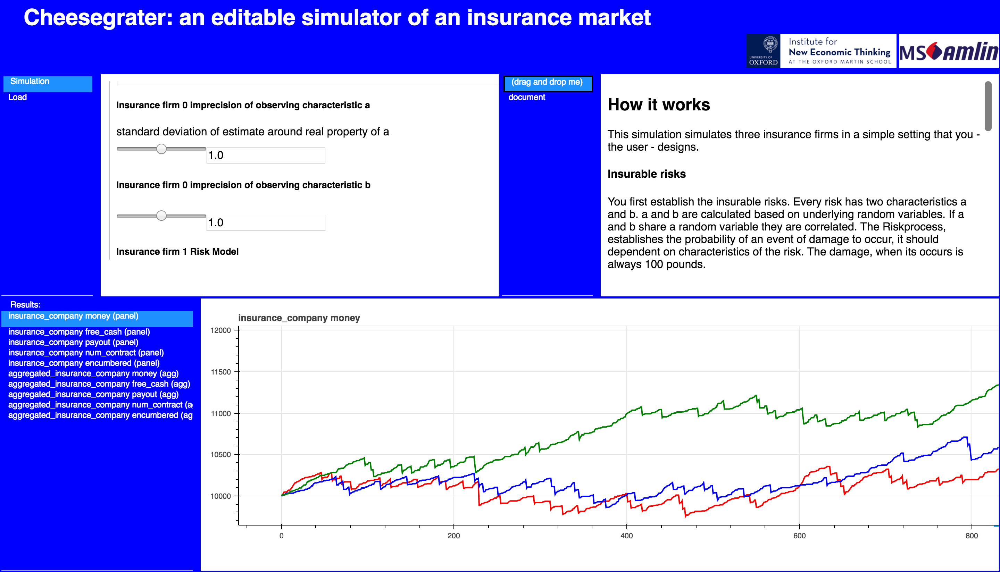

.. Agent-Based Computational Economics documentation master file, created by
   sphinx-quickstart on Mon Sep  4 18:00:57 2017.
   You can adapt this file completely to your liking, but it should at least
   contain the root `toctree` directive.

abcEconomics the Agent-Based Computational Economy platform that makes modeling easier
//////////////////////////////////////////////////////////////////////////////////////

abcEconomics is a Python based modeling platform for economic simulations.
abcEconomics comes with standard functions to simulations of trade, production
and consumption. The modeler can concentrate on implementing
the logic and decisions of an agents; abcEconomics takes care of all exchange
of goods and production and consumption.

In abcEconomics  goods have the physical properties of
goods in reality in the sense that if agent A gives a good to agent B, then
- unlike information - agent B receives the good and agent B does not have
the good anymore.
The ownership and transformations (production or consumption) of goods are
automatically handled by the platform.

abcEconomics models are programmed in standard Python, stock functions of agents
can be inherited from archetype classes (Firm or Household). The only
not-so-standard Python is that agents are executed in parallel by the
Simulation class (in start.py).

abcEconomics allows the modeler to program agents as ordinary Python class-objects,
but run the simulation on a multi-core/processor computer. It takes no
effort or intervention from the modeler to run the simulation on a
multi-core system.
The speed advantages of using abcEconomics with multi-processes enabled.
abcEconomics are typically only observed for 10000 agents and more. Below, it
might be slower than pure python implementation. abcEconomics supports pypy3,
which is approximately 30 times faster than CPython.

abcEconomics provides two more additions to the Python language.
First of all, agent groups can be executed simultaneously. Secondly agents can
interact with each other sending messages (and goods).

The audience of abcEconomics are economists that want to model agent-based
models of trade and production.

abcEconomics does support an accounting framework
for financial simulations. `abcFinance can be downloaded here <https://github.com/AB-CE/abcFinance>`_.

abcEconomics runs on macOS, Windows, and Linux. abcEconomics runs 30x faster on pypy!

Introduction
============
.. toctree::
   :maxdepth: 2

   introduction
   installation
   jupyter_tutorial
   Walk_through
   tutorial
   examples
   unit_testing

Simulation Programming
======================
.. toctree::
   :maxdepth: 1

   simulation
   Agent_class
   group
   Goods
   Trade
   Messaging
   Firm
   Household
   Database
   notenoughgoods

Advanced
========
.. toctree::
   :maxdepth: 1

   Quote
   spatial
   plugins

Graphical User Interface and Results
====================================
.. toctree::
   :maxdepth: 1

   gui
   deploy

Frequently asked Questions
==========================
.. toctree::
   :maxdepth: 1

   faq
   troubleshooting

Indices and tables
==================

* :ref:`genindex`
* :ref:`modindex`
* :ref:`search`

.. [#scheduler] the Simulation class
.. [#noeq] with out the equilibrium of course
