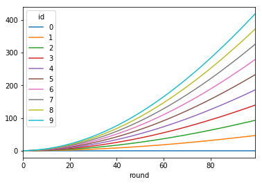

Interactive jupyter / IPython notebook Tutorial
===============================================

This tutorial works on jupyter notebook. Please download examples from
here: https://github.com/AB-CE/examples and load the jupyter\_tutorial
by changing in the ``examples/jupyter_tutorial`` folder and typing
``jupyter notebook jupyter_tutorial.ipynb``. Then you can execute the
notebook cell by cell and observe ABCE at work.

.. code:: ipython3

    import abce

.. code:: ipython3

    simulation = abce.Simulation(name='ipythonsimulation', processes=1)

Creating the Agent
------------------

We create a simple agent and intialize it. An agent is an object that
has propeties and does things. In python that is a class. We create an
agent that has a name, knows the world size and can say his name.

The agent needs to inherit from abce.Agents. *The ``__init__`` function
should not be overwritten, instead create an ``init`` function*. The
init function will be called during initialisation. The agents gets two
parameters. All agents get the parameters we will specify in the next
round. From agent\_parameters the agents get only agent\_parameters[id],
where id is the number of the agent. Agents have for now only one
function. They can say their name.

.. code:: ipython3

    class Agent(abce.Agent):
        def init(self, parameters, agent_parameter):
            self.family_name = agent_parameter
            self.world_size = parameters['world_size']
        def say(self):
            print("hello I am %s my id %i and my group is '%s', it is the %i round" % (self.family_name, self.id, self.group, self.round))

From the abstract agent, we create four concrete agents.

.. code:: ipython3

    agents = simulation.build_agents(Agent, 'agent',
                                    parameters={"world_size": 10},
                                    agent_parameters=['fred', 'astaire', 'altair', 'deurich'])

``agents`` allows you to call each agents in the agents group. Each
agent in this group has a group name, which is 'agent' and an id.
Further we give each of the agents a parameter a family\_name. Run the
simulation and let all agents say their name:

.. code:: ipython3

    for r in range(5):
        simulation.advance_round(r)
        agents.say()

.. parsed-literal::

    Round0
    hello I am fred my id 0 and my group is 'agent', it is the 0 round
    hello I am astaire my id 1 and my group is 'agent', it is the 0 round
    hello I am altair my id 2 and my group is 'agent', it is the 0 round
    hello I am deurich my id 3 and my group is 'agent', it is the 0 round
    Round1
    hello I am fred my id 0 and my group is 'agent', it is the 1 round
    hello I am astaire my id 1 and my group is 'agent', it is the 1 round
    hello I am altair my id 2 and my group is 'agent', it is the 1 round
    hello I am deurich my id 3 and my group is 'agent', it is the 1 round
    Round2
    hello I am fred my id 0 and my group is 'agent', it is the 2 round
    hello I am astaire my id 1 and my group is 'agent', it is the 2 round
    hello I am altair my id 2 and my group is 'agent', it is the 2 round
    hello I am deurich my id 3 and my group is 'agent', it is the 2 round
    Round3
    hello I am fred my id 0 and my group is 'agent', it is the 3 round
    hello I am astaire my id 1 and my group is 'agent', it is the 3 round
    hello I am altair my id 2 and my group is 'agent', it is the 3 round
    hello I am deurich my id 3 and my group is 'agent', it is the 3 round
    Round4
    hello I am fred my id 0 and my group is 'agent', it is the 4 round
    hello I am astaire my id 1 and my group is 'agent', it is the 4 round
    hello I am altair my id 2 and my group is 'agent', it is the 4 round
    hello I am deurich my id 3 and my group is 'agent', it is the 4 round

It is necessary to tell the simulation when a new round starts and what time it is
simulation.advance_round(r) does that. The parameter can be any representation of
time.

Giving a Good
-------------

ABCE provide goods. Goods are things that can be given, sold or
transformed. We create 5 agents, the first one has a ball the agents
pass the ball around.

.. code:: ipython3

    class Kid(abce.Agent):
        def init(self, parameters, agent_parameters):
            self.num_kids = parameters['num_kids']
            if self.id == 0:
                self.create('ball', 1)

        def whether_I_have_the_ball(self):
            if self.possession('ball') > 0:
                print('*', end="", flush=True)
            else:
                print('.', end="", flush=True)

        def give_the_ball_to_the_next_kid(self):
            next_kid = (self.id + 1) % self.num_kids  # the id of the next kid, if I am the last the first kid
            if self.possession('ball') >= 1:
                self.give('kid', next_kid, good='ball', quantity=1)

self.create, creates an object. self.possession, checks how much of one
object an agent has. self.give, gives an object to another agent,
specied by its group name and its id.

.. code:: ipython3

    num_kids = 5

.. code:: ipython3

    simulation = abce.Simulation(name='ipythonsimulation', processes=1)

.. code:: ipython3

    kids = simulation.build_agents(Kid, 'kid', number=num_kids,
                                    parameters={"num_kids": num_kids})

When agent\_parameters is not specified the numer of agents to be
created needs to be spezified

.. code:: ipython3

    for r in range(7):
        simulation.advance_round(r)
        kids.whether_I_have_the_ball()
        print()
        kids.give_the_ball_to_the_next_kid()

.. parsed-literal::

    Round0
    *....
    Round1
    .*...
    Round2
    ..*..
    Round3
    ...*.
    Round4
    ....*
    Round5
    *....
    Round6
    .*...

Trade
-----

.. code:: ipython3

    from random import randrange

Well in every school yard we have a drug dealer.

.. code:: ipython3

    class NewKid(abce.Agent):
        def init(self, parameters, agent_parameters):
            self.num_dealers = parameters['num_dealers']
            self.create('money', 100)  # don't we all wish you'd this function in real live?

        def buy_drugs(self):
            drug_dealer_id = randrange(self.num_dealers)
            self.buy('drug_dealer', drug_dealer_id, good='drugs', quantity=1, price=10)

        def print_possessions(self):
            print('    ' + self.group + str(dict(self.possessions())))

The new kids, approach a random drug dealer and offer him 10 bucks.

.. code:: ipython3

    class DrugDealer(abce.Agent):
        def init(self, parameters, agent_parameters):
            self.create('drugs', 1)

        def sell_to_customers(self):
            for offer in self.get_offers('drugs'):
                if offer.price >= 10 and self.possession('drugs') > 1:
                    self.accept(offer)

        def print_possessions(self):
            print('    ' + self.group + str(dict(self.possessions())))

Drug dealer look at all the sell offers they get and decide to sell only
to those kids that are willing to give them at least 10 dollars.

.. code:: ipython3

    simulation_parameters={'num_dealers': 1, 'num_customers': 1, 'rounds': 2}

.. code:: ipython3

    simulation = abce.Simulation(name='school_yard', processes=1)

.. code:: ipython3

    drug_dealers = simulation.build_agents(DrugDealer, 'drug_dealer', number=simulation_parameters['num_dealers'])

.. code:: ipython3

    customers = simulation.build_agents(NewKid, 'customer', number=simulation_parameters['num_customers'], parameters=simulation_parameters)

builds 1 drug dealer and one customer.

.. code:: ipython3

    kids = drug_dealers + customers

Groups of agents can be merged to 'super' groups. We will print the
amount of drugs and money all kids have for each of the two kids

.. code:: ipython3

    for r in range(simulation_parameters['rounds']):
        simulation.advance_round(r)
        print('Customer offers 10 dollar:')
        customers.buy_drugs()
        kids.print_possessions()
        print('Drug Dealer accepts or rejects the offer:')
        drug_dealers.sell_to_customers()
        kids.print_possessions()
        print()

.. parsed-literal::

    Round0
    Customer offers 10 dollar:
        drug_dealer{'money': 0, 'drugs': 1.0}
        customer{'money': 90.0}
    Drug Dealer accepts or rejects the offer:
        drug_dealer{'money': 0, 'drugs': 1.0}
        customer{'money': 100.0}

    Round1time only simulation   0.15

    Customer offers 10 dollar:
        drug_dealer{'money': 0, 'drugs': 1.0}
        customer{'money': 90.0}
    Drug Dealer accepts or rejects the offer:
        drug_dealer{'money': 0, 'drugs': 1.0}
        customer{'money': 100.0}

When looking at round one one can see that after the customer offered 10
dollars, the 10 dollars are not available to him util the deal has
either been accepted or rejected. After the drug dealer accepts the
offer in the 0 round. The money is transfered to the drug dealer and the
drugs to the customer.

In round 1, where the drug dealer runs out of drugs the 10 dollars go
back to the customer.

.. code:: ipython3

    for r in range(simulation_parameters['rounds']):
        simulation.advance_round(r)
        print('Customer offers 10 dollar:')
        customers.buy_drugs()
        kids.print_possessions()
        print('Drug Dealer accepts or rejects the offer:')
        drug_dealers.sell_to_customers()
        kids.print_possessions()
        print()

.. parsed-literal::

    Round0
    Customer offers 10 dollar:
        drug_dealer{'money': 0, 'drugs': 1.0}
        customer{'money': 90.0}
    Drug Dealer accepts or rejects the offer:
        drug_dealer{'money': 0, 'drugs': 1.0}
        customer{'money': 100.0}

    Round1
    Customer offers 10 dollar:
        drug_dealer{'money': 0, 'drugs': 1.0}
        customer{'money': 90.0}
    Drug Dealer accepts or rejects the offer:
        drug_dealer{'money': 0, 'drugs': 1.0}
        customer{'money': 100.0}

Lets capture data
-----------------

There are three ways of capturing data. ``aggregate`` and ``panel``
collect data from a specified group at a specified point of time. This
has the advantage that there is no logging code in the agent class.
``self.log('name', value)`` saves a value under a certain name.

.. code:: ipython3

    from math import sin

    class DataDealer(abce.Agent):
        def init(self, simulation_parameters, agent_parameters):
            self.count = 0
            self.create('money', 0)

        def counting(self):
            self.count += 1
            self.curve = sin(self.count / 100)
            self.create('money', self.curve * self.id)

.. code:: ipython3

    simulation = abce.Simulation(name='gatherdata', processes=1)

It is specified which agents group collects which variables and
possessions.

.. code:: ipython3

    datadealers = simulation.build_agents(DataDealer, 'datadealer', number=10)

Every round the groups need to be instructed to collect the according
data. **simulation.finalize()** must be called after the simulation, to
write the data! Otherwise the program hangs. Never forget to put
**simulation.finalize()** otherwise the program will just block()

.. code:: ipython3

    for r in range(100):
        simulation.advance_round(r)
        datadealers.counting()
        datadealers.agg_log(variables=['count'])
        datadealers.panel_log(possessions=['money'], variables=['curve'])
    simulation.finalize()

.. parsed-literal::

    Round0
    Round1time with data and network   0.20

    Round2
    Round3
    Round4
    Round5
    Round6
    Round7
    Round8
    {
        "name": "ipythonsimulation",
        "random_seed": 1504186751.3476071,
        "num_kids": 5
    Round9

    Round10
    Round11
    Round12
    Round13
    Round14
    Round15
    Round16
    Round17
    Round18
    Round19
    Round20
    Round21
    Round22
    Round23
    Round24
    Round25
    Round26
    Round27
    Round28
    Round29
    Round30
    Round31
    Round32
    Round33
    Round34
    Round35
    Round36
    Round37
    Round38
    Round39
    Round40
    Round41
    Round42
    Round43
    Round44
    Round45
    Round46
    Round47
    Round48
    Round49
    Round50
    Round51
    Round52
    Round53
    Round54
    Round55
    Round56
    Round57
    Round58
    Round59
    Round60
    Round61
    Round62
    Round63
    Round64
    Round65
    Round66
    Round67
    Round68
    Round69
    Round70
    Round71
    Round72
    Round73
    Round74
    Round75
    Round76
    Round77
    Round78
    Round79
    Round80
    Round81
    Round82
    Round83
    Round84
    Round85
    Round86
    Round87
    Round88
    Round89
    Round90
    Round91
    Round92
    Round93
    Round94
    Round95
    Round96
    Round97
    Round98
    Round99

    time only simulation   0.16
    time with data and network   0.32
    {
        "name": "gatherdata",
        "random_seed": 1504186751.529168
    }

We can find the directory of the simulation data by using the
``simulation.path`` property

.. code:: ipython3

    print(simulation.path)

.. parsed-literal::

    /Users/taghawi/Dropbox/workspace/abce_examples/examples/jupyter_tutorial/result/gatherdata_2017-08-31_10-39

In that directory are the data files and a describtion.txt

.. code:: ipython3

    import os
    os.listdir(simulation.path)

.. parsed-literal::

    ['aggregate_datadealer.csv',
     'aggregated_datadealer.csv',
     'description.txt',
     'panel_datadealer.csv']

Using statistical software
--------------------------

.. code:: ipython3

    import pandas as pd

.. code:: ipython3

    %matplotlib inline

.. code:: ipython3

    df = pd.read_csv(simulation.path + '/panel_datadealer.csv')

.. code:: ipython3

    df.head(20)

.. raw:: html

    

    
    <table border="1" class="dataframe">
      <thead>
        <tr style="text-align: right;">
          <th></th>
          <th>index</th>
          <th>curve</th>
          <th>money</th>
          <th>round</th>
          <th>id</th>
        </tr>
      </thead>
      <tbody>
        <tr>
          <th>0</th>
          <td>1</td>
          <td>0.010000</td>
          <td>0.000000</td>
          <td>0</td>
          <td>0</td>
        </tr>
        <tr>
          <th>1</th>
          <td>2</td>
          <td>0.010000</td>
          <td>0.010000</td>
          <td>0</td>
          <td>1</td>
        </tr>
        <tr>
          <th>2</th>
          <td>3</td>
          <td>0.010000</td>
          <td>0.020000</td>
          <td>0</td>
          <td>2</td>
        </tr>
        <tr>
          <th>3</th>
          <td>4</td>
          <td>0.010000</td>
          <td>0.030000</td>
          <td>0</td>
          <td>3</td>
        </tr>
        <tr>
          <th>4</th>
          <td>5</td>
          <td>0.010000</td>
          <td>0.039999</td>
          <td>0</td>
          <td>4</td>
        </tr>
        <tr>
          <th>5</th>
          <td>6</td>
          <td>0.010000</td>
          <td>0.049999</td>
          <td>0</td>
          <td>5</td>
        </tr>
        <tr>
          <th>6</th>
          <td>7</td>
          <td>0.010000</td>
          <td>0.059999</td>
          <td>0</td>
          <td>6</td>
        </tr>
        <tr>
          <th>7</th>
          <td>8</td>
          <td>0.010000</td>
          <td>0.069999</td>
          <td>0</td>
          <td>7</td>
        </tr>
        <tr>
          <th>8</th>
          <td>9</td>
          <td>0.010000</td>
          <td>0.079999</td>
          <td>0</td>
          <td>8</td>
        </tr>
        <tr>
          <th>9</th>
          <td>10</td>
          <td>0.010000</td>
          <td>0.089999</td>
          <td>0</td>
          <td>9</td>
        </tr>
        <tr>
          <th>10</th>
          <td>11</td>
          <td>0.019999</td>
          <td>0.000000</td>
          <td>1</td>
          <td>0</td>
        </tr>
        <tr>
          <th>11</th>
          <td>12</td>
          <td>0.019999</td>
          <td>0.029999</td>
          <td>1</td>
          <td>1</td>
        </tr>
        <tr>
          <th>12</th>
          <td>13</td>
          <td>0.019999</td>
          <td>0.059997</td>
          <td>1</td>
          <td>2</td>
        </tr>
        <tr>
          <th>13</th>
          <td>14</td>
          <td>0.019999</td>
          <td>0.089996</td>
          <td>1</td>
          <td>3</td>
        </tr>
        <tr>
          <th>14</th>
          <td>15</td>
          <td>0.019999</td>
          <td>0.119994</td>
          <td>1</td>
          <td>4</td>
        </tr>
        <tr>
          <th>15</th>
          <td>16</td>
          <td>0.019999</td>
          <td>0.149993</td>
          <td>1</td>
          <td>5</td>
        </tr>
        <tr>
          <th>16</th>
          <td>17</td>
          <td>0.019999</td>
          <td>0.179991</td>
          <td>1</td>
          <td>6</td>
        </tr>
        <tr>
          <th>17</th>
          <td>18</td>
          <td>0.019999</td>
          <td>0.209990</td>
          <td>1</td>
          <td>7</td>
        </tr>
        <tr>
          <th>18</th>
          <td>19</td>
          <td>0.019999</td>
          <td>0.239988</td>
          <td>1</td>
          <td>8</td>
        </tr>
        <tr>
          <th>19</th>
          <td>20</td>
          <td>0.019999</td>
          <td>0.269987</td>
          <td>1</td>
          <td>9</td>
        </tr>
      </tbody>
    </table>
    

.. code:: ipython3

    df.pivot(index='round', columns='id', values='money').plot()

.. parsed-literal::

    <matplotlib.axes._subplots.AxesSubplot at 0x10f0ee6a0>

When running a simulation with python from a start.py
simulation.graphs() displays all recorded data. You can also use the
@gui decorator to ship abce as an interactive web-app.
